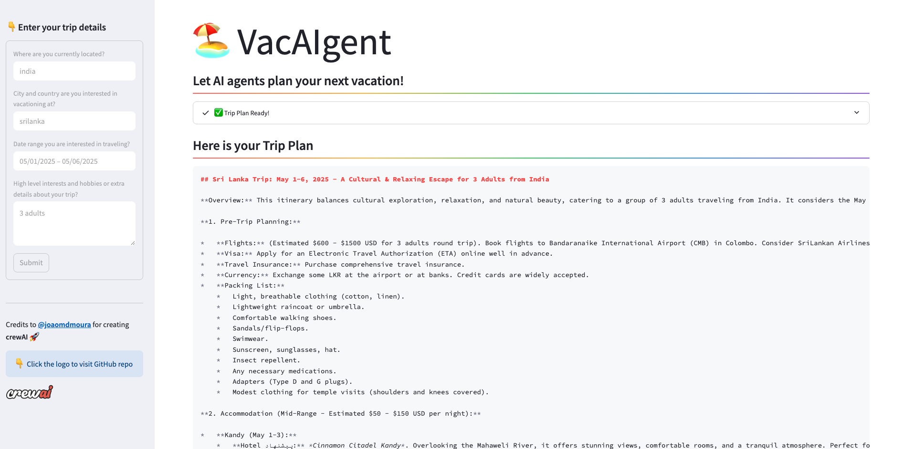

# 🏖️ Trip Planner: Streamlit with CrewAI


## Introduction

Trip Planner leverages the CrewAI framework to automate and enhance the trip planning experience, integrating a CLI, FASTAPI, and a user-friendly Streamlit interface.


## CrewAI Framework

CrewAI simplifies the orchestration of role-playing AI agents. In VacAIgent, these agents collaboratively decide on cities and craft a complete itinerary for your trip based on specified preferences, all accessible via a streamlined Streamlit user interface.


## Running the Application

To experience the VacAIgent app:

- **Configure Environment**: Set up the environment variables for [Browseless](https://www.browserless.io/), [Serper](https://serper.dev/), and [OpenAI](https://openai.com/). Use the `secrets.example` as a guide to add your keys then move that file (`secrets.toml`) to `.streamlit/secrets.toml`.

- **Install Dependencies**: Execute `pip install -r requirements.txt` in your terminal.
- **Launch the CLI Mode**: Run `python cli_app.py -o "Bangalore, India" -d "Krabi, Thailand" -s 2024-05-01 -e 2024-05-10 -i "2 adults who love swimming, dancing, hiking, shopping, food, water sports adventures, rock climbing"` to start the CLI Mode.
- **Launch the FASTAPI**: Run `uvicorn api_app:app --reload` to start the FASTAPI server.
- **Launch the Streamlit App**: Run `streamlit run streamlit_app.py` to start the Streamlit interface.

## Installation

1. Install dependencies:
   ```
   pip install -r requirements.txt
   ```

2. Set API keys in the scripts.

## Usage

- Run `advanced_trip_planner.py` for the main system.
- Run `fine_tune_llm.py` for LLM fine-tuning.
- Use Streamlit app for UI.

## Files

- `advanced_trip_planner.py`: Main agentic RAG system.
- `fine_tune_llm.py`: LLM fine-tuning script.
- `requirements.txt`: Updated with advanced libraries.
- Original files modified for integration.

## Details & Explanation

- **Streamlit UI**: The Streamlit interface is implemented in `streamlit_app.py`, where users can input their trip details.



- **Components**:
  - `./trip_tasks.py`: Contains task prompts for the agents.
  - `./trip_agents.py`: Manages the creation of agents.
  - `./tools directory`: Houses tool classes used by agents.
  - `./streamlit_app.py`: The heart of the Streamlit app.

## Using LLM Models

To switch LLMs from differnet Providers

```python
class TripAgents():
    def __init__(self, llm: BaseChatModel = None):
        if llm is None:
            #self.llm = LLM(model="groq/deepseek-r1-distill-llama-70b")
            self.llm = LLM(model="gemini/gemini-2.0-flash")
        else:
            self.llm = llm

```
[Connect to LLMs](https://docs.crewai.com/how-to/llm-connections#connect-crewai-to-llms)


### Integrating Ollama with CrewAI

Pass the Ollama model to agents in the CrewAI framework:

```python
    agent = Agent(
        role='Local AI Expert',
        goal='Process information using a local model',
        backstory="An AI assistant running on local hardware.",
        llm=LLM(model="ollama/llama3.2", base_url="http://localhost:11434")
    )
```

